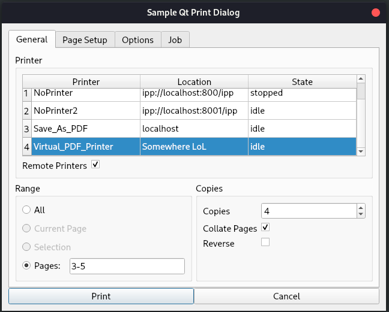

# My project for Google Summer of Code 2020
I worked with Open Printing (under The Linux Foundation) for Google Summer of Code 2020. My project was titled [Common Print Dialog Backends (CPDB) Qt Implementation](https://summerofcode.withgoogle.com/projects/#6705486251950080).

## About the project
### Common Print Dialog Backends
CPDB is one of the main projects of Open Printing. It aims to separate the development of print dialogs and the support for different print technologies. I idea is to have a unified library ([cpdb-libs](https://github.com/OpenPrinting/cpdb-libs)) which the applications can use to check available printers, check the various options supported by those printers, and send print jobs with specified settings. This way, when new printing technologies are developed, all the applications won't have to be updated to use those technologies. Only the CPDB libraries need to be updated, and all the applications that use CPDB will automatically support the new technologies. Currently, the cpdb-libs has backends to support printing to [a file](https://github.com/OpenPrinting/cpdb-backend-file), on [CUPS](https://github.com/OpenPrinting/cpdb-backend-cups) and on [Google Cloud Print](https://github.com/OpenPrinting/cpdb-backend-gcp).

### Qt Print Support
[Qt](https://www.qt.io/) is a popular cross-platform application development framework. Applications built using Qt can support cros platform printing through [Qt Print Support](https://doc.qt.io/qt-5/qtprintsupport-index.html). However, on Linux, Qt Print Support can only print to CUPS and to a file. Further, to support any new features, Qt Print Support would need to be updated.

### My job
My job was to make Qt Print Support use the Common Print Dialog Backends. This would not change anything for the developer building an application - they would use the existing QPrintDialog API. However, the end user would see the difference. If the Common Print Dialog Backends are not installed on the user's system, the Qt Print Support would fall back to its original implementation. But if the beckends are installed, the user would see the new print dialog, perhaps with more printers (from non-CUPS backends) and more supported options.

## Work Done

My commits can be found [here](https://github.com/dryairship/qtbase/commits/gsoc-2020). You can compare the changes [here](https://github.com/dryairship/qtbase/compare/5.15...dryairship:gsoc-2020). A unified diff is available [here](https://github.com/dryairship/qtbase/compare/5.15...dryairship:gsoc-2020.diff).

### Description of the work done
 - [687700f008](https://github.com/dryairship/qtbase/commit/687700f00872f0a164d09c22929cdff5b2d38db2): I built the GUI of the new print dialog. A screenshot of the dialog is shown below:

 - [468c648649](https://github.com/dryairship/qtbase/commit/468c648649482478477ee5509c6bcd7f1d0bcc3e): Qt Print Support uses various plugins to support printing on different platforms. For Linux, it uses the CUPS Print Plugin. I created a new Print Plugin called the "CPDB Print Plugin" to enable printing on linux using the Common Print Dialog Backends.
 - [ee7f9f1cf1](https://github.com/dryairship/qtbase/commit/ee7f9f1cf1d85a44d93bcc9dd6de35e93f6d30f7): The dialog and the plugin were tested and some bug fixes/changes were made.
 - [5cfd7afda1](https://github.com/dryairship/qtbase/commit/5cfd7afda1be593237992aa3d0c6ba7a6d44e5f1): I updated the build settings such that Qt Print Support uses CPDB only when cpdb-libs is installed on the user's system and the `cpdb` feature is enabled. I also updated the source files with the licenses and documentation comments.

### Other minor tasks
 - I updated cpdb-backend-cups to not send the `media-col` option to the frontend, as that is not user-settable. ([PR #3](https://github.com/OpenPrinting/cpdb-backend-cups/pull/3))
 - I updated cpdb-backend-cups to send the `page-set` option to the frontend, even though the CUPS API does not return that option. ([PR #4](https://github.com/OpenPrinting/cpdb-backend-cups/pull/4))

### Work left
The only task remaining is to get the code merged in Qt's official repo. I'd also need to do any changes suggested by Qt's reviewers.

## Acknowledgements
I am thankful to my mentors Dongxu and Till for their guidance throughout the project. The interactions with them and working on this project were together a great learning experience and I gained a lot of knowledge into the working of printing systems as well as how a large library like Qt is maintained.

I would also like to thank Rithvik, who worked on this project before, for being available for guidance.

It was a great experience working on this project!
